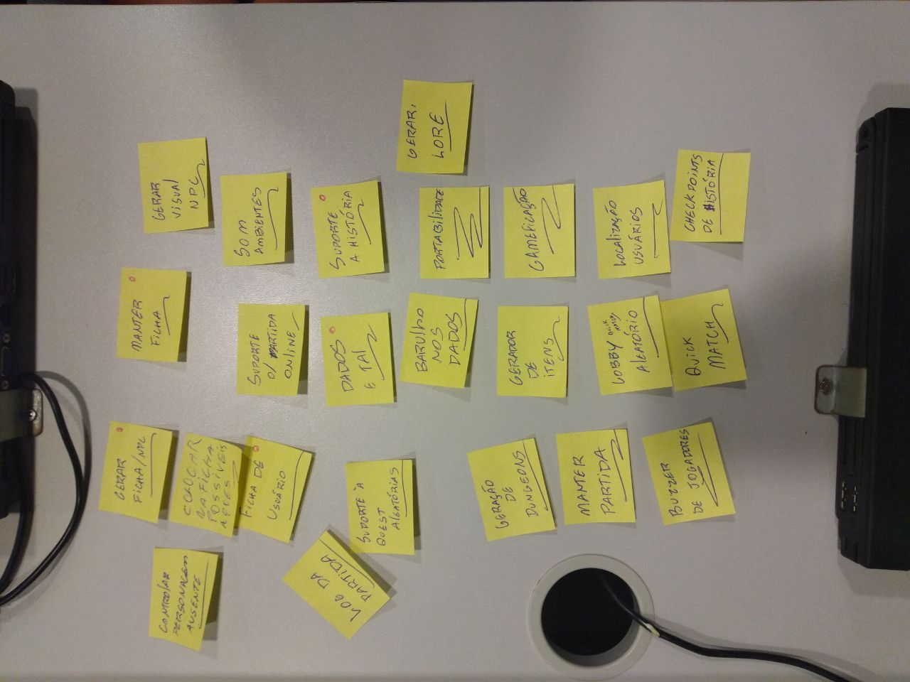
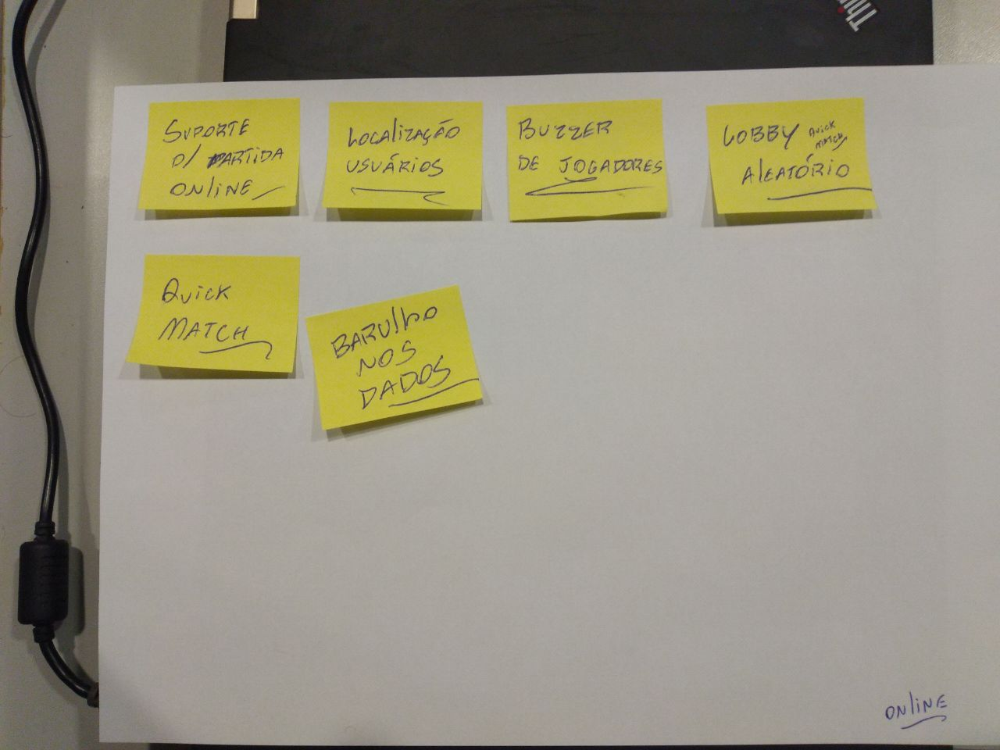

# Brainstorm

# 1. Introdução
A famosa "tempestade de idéias", também conhecida como brainstorming, pode ser definida como a geração contínua de idéias, independente do número de pessoas que esteja envolvido na ação. É baseada na necessidade de ter fatos, gerar ideias e encontrar soluções. Desenvolvido por Alex F. Osborn, então diretor daBBD&O¹, o processo é descrito por ele como "usar o cérebro para atacar um problema criativo". Cada stormer – nome dado aos participantes do processo – usa a criatividade e audácia para atacar o mesmo objeto de estudo. Dessa forma, "a criatividade é encorajada e não é permitido que as idéias sejam avaliadas e discutidas até que todos tenham opinado. Todas as idéias são consideradas legítimas, e até mesmo as mais bobas ou ridículas podem vir a ser as mais férteis. Um brainstorming estruturado produz inúmeras idéias criativas sobre qualquer
questão central" (BBDO).
O brainstorming é muito utilizado para conseguir gerar um número grande de ideias em um espaço de tempo determinado, e, embora seja usado por muitas pessoas que trabalham diretamente com a criatividade, a aplicação deste método pode ir além disso. É sabido que esse processo é usado em agências de publicidade, agências de comunicação, departamentos de jornalismo e em grandes corporações que precisam constantemente gerar soluções para que o processo de resolução dos problemas seja otimizado e haja um número maior de ideias, o que
pode acarretar um número maior de soluções criativas. (Osborn,1987, p.206)

# 2. Objetivo
Este documento tem por finalidade apresentar os as definições iniciais elicitadas pela técnica de brainstorming. Após a decisão do tema, o resultado foi anotado em post-its e foram colocados em uma mesa como pode ser visto nas imagens abaixo.

# 3. Brainstorming

Com todas essas ideias decidimos organizá-las, e organizamos entre as ideias que seram utilizadas para uma plataforma para que possa jogar online, uma que se sobrar tempo poderiamos realizar ou seja não e nossa prioridade e outra que seria o escopo do projeto.

## Escopo do projeto

[ Visualizar em tamanho maior ](../../img/escopo_projeto.jpg)

## Escopo a para versão online

[ Visualizar em tamanho maior ](../../img/escopo_projeto_online.jpg)

## Escopo do projeto

[ Visualizar em tamanho maior ](../../img/ecopo_outros.jpg)

# 4. Conclusão

Dessa forma, é importante focar em cada etapa do Brainstorm, dando atenção à opinião de todos os participantes e prezando pela boa organização realizada pelo mediador, para que o resultado do processo seja enriquecedor e positivo. A utilização desta técnica se mostrou fundamental para as definições iniciais do escopo do projeto, assim como funcionalidades principais.

# 5. Referências
BRAINSTORMING THAT WORKS. Alex Osborn “brainstorming” – He coined the word. BRAINSTORMING THAT WORKS. Disponível em <http://bit.ly/1uGac2S>. Acesso em: 30 set 2019.
