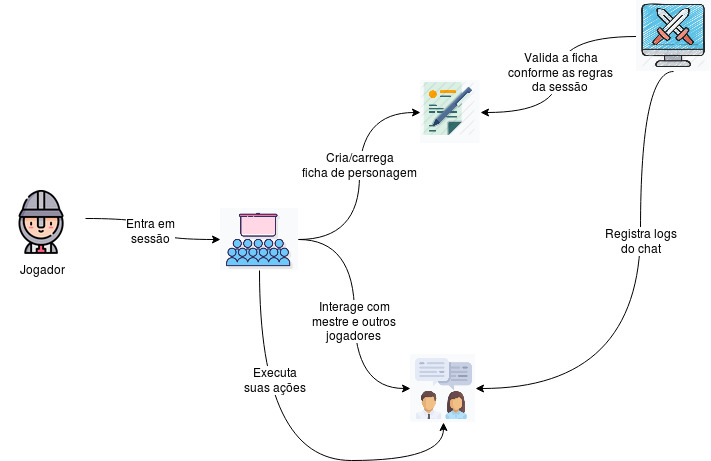
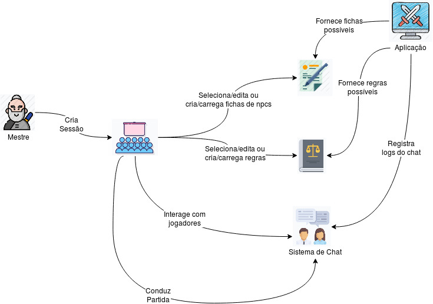
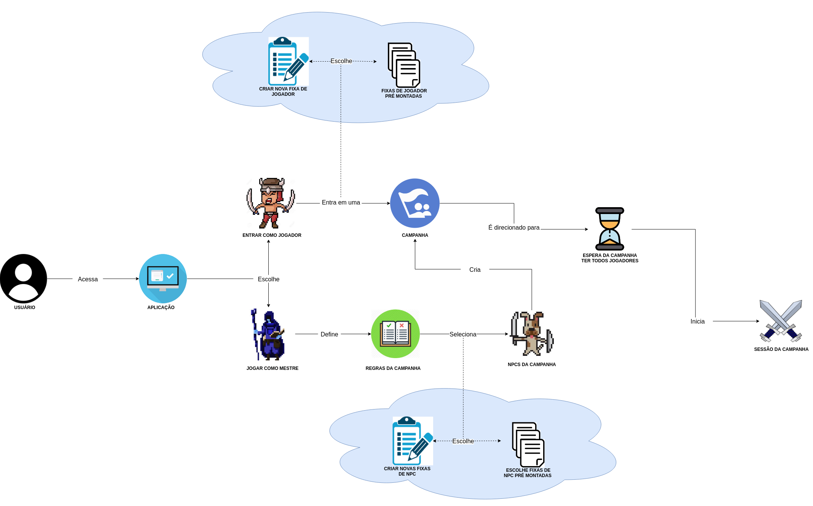
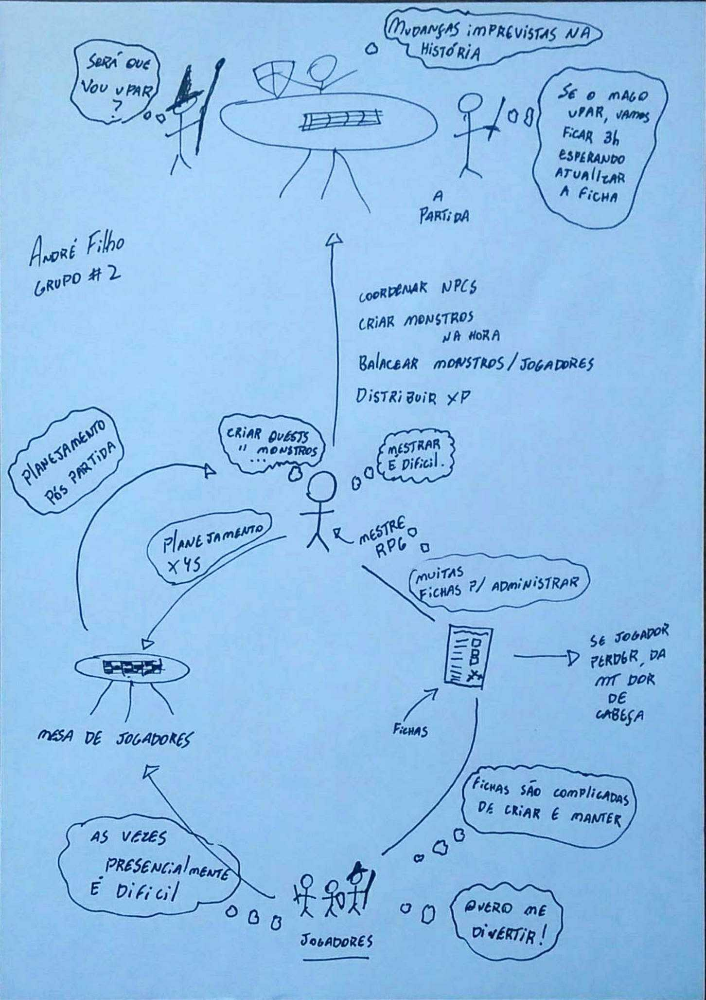

# Rich Pictures

## 1. Introdução

As Rich Pictures foram desenvolvidas como parte da Soft Systems Methodology, de Peter Checkland, para reunir informações sobre uma situação complexa. A ideia de usar desenhos ou figuras para pensar sobre problemas é comum em vários métodos de resolução de problemas ou de pensamento criativo (incluindo terapia) porque nossa consciência intuitiva se comunica mais facilmente em impressões e símbolos do que em palavras. Desenhos podem evocar e registrar _insights_ sobre uma situação e diferentes técnicas de visualização, como braistorming visual, manipulação de imagens e sonhos criativos, foram desenvolvidas enfatizando uma dessas duas finalidades sobre a outra. 
Estes desenhos são realizados durante o estágio de pré-análise (como artefato de pré-rastreabilidade), antes que se saiba claramente quais partes da situação devem ser consideradas como processo ou como estrutura. 

## 2. Objetivo

O principal objetivo de realizar esses richpictures é identificar:
* processos de negócio e seus requisitos
* atores envolvidos
* relacionamentos entre processos e atores

## 3. Metodologia

A realização de richpictures consiste em realizar desenhos parecidos com mapas conceituais, porém especificando cada ação que pode ser feita no aplicativo, juntamente com todas as interações com atores do mundo real.

## 4. Rich Pictures Gerais

### Ações do Jogador

|**Objeto**|**Rich Picture**|
|--|--|
|**Versões anteriores**| - |
|**Versão**| 1.0 |
|**Autor**|Eduardo Yoshida|
| **Descrição** | richpicture das ações do jogador |
| **Data** | 20/08/2019 |

### Ações do Mestre

|**Objeto**|**Rich Picture**|
|--|--|
|**Versões anteriores**| - |
|**Versão**| 1.0 |
|**Autor**|Eduardo Yoshida|
| **Descrição** | richpicture das ações do mestre |
| **Data** | 20/08/2019 |

### Fluxo de Incio de Jogo

|**Objeto**|**Rich Picture**|
|--|--|
|**Versões anteriores**| - |
|**Versão**| 1.0 |
|**Autor**|Andre Bargas|
| **Descrição** | richpicture do fluxo de ações para inicio da campanha |
| **Data** | 20/08/2019 |

## Rich Pictures Individuais

|**Objeto**|**Rich Picture**|
|--|--|
|**Versões anteriores**| - |
|**Versão**| 1.0 |
|**Autor**|Andre Bargas|
| **Descrição** | richpicture da aplicação **Master of Puppets** |
| **Data** | 20/08/2019 |

|**Objeto**|**Rich Picture**|
|--|--|
|**Versões anteriores**| - |
|**Versão**| 1.0 |
|**Autor**|Andre de Sousa|
| **Descrição** | richpicture da aplicação **Master of Puppets** |
| **Data** | 20/08/2019 |

<!-- adicionado no repositório dia 31 ago, sry -->

|**Objeto**|**Rich Picture**|
|--|--|
|**Versões anteriores**| - |
|**Versão**| 1.0 |
|**Autor**|Eduardo Yoshida|
| **Descrição** | richpicture da aplicação **Master of Puppets** |
| **Data** | 20/08/2019 |

|**Objeto**|**Rich Picture**|
|--|--|
|**Versões anteriores**| - |
|**Versão**| 1.0 |
|**Autor**|Gustavo Moreira|
| **Descrição** | richpicture visão da aplicação a partir do mestre de RPG **Master of Puppets** |
| **Data** | 20/08/2019 |

|**Objeto**|**Rich Picture**|
|--|--|
|**Versões anteriores**| - |
|**Versão**| 1.0 |
|**Autor**|Andre Bargas|
| **Descrição** | richpicture da aplicação **Master of Puppets** |
| **Data** | 20/08/2019 |

|**Objeto**|**Rich Picture**|
|--|--|
|**Versões anteriores**| - |
|**Versão**| 1.0 |
|**Autor**|Lucas Machado|
| **Descrição** | richpicture da aplicação **Master of Puppets** |
| **Data** | 21/08/2019 |

|**Objeto**|**Rich Picture**|
|--|--|
|**Versões anteriores**| - |
|**Versão**| 1.0 |
|**Autor**|João Pedro|
| **Descrição** | richpicture da concorrência **Master of Puppets** |
| **Data** | 22/08/2019 |

## 5. Referências

SERRANO, Maurício; SERRANO, Milene. Requisitos - Aula 04, 37 Slides. 2º/2018. Material apresentado para a disciplina de Requisitos de Software no curso de Engenharia de Software da UnB, FGA.
