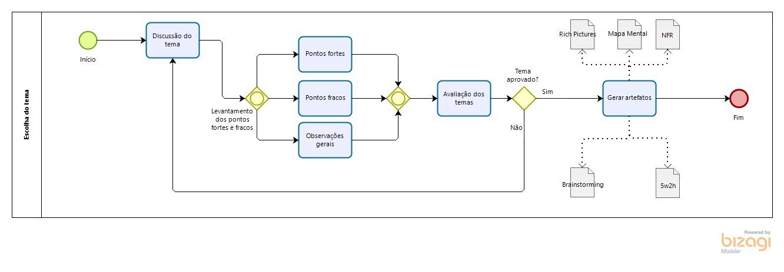
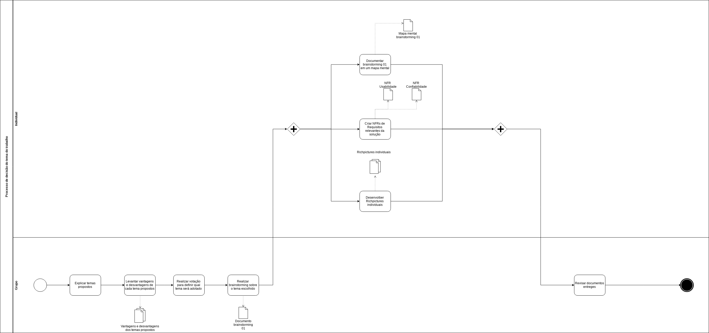
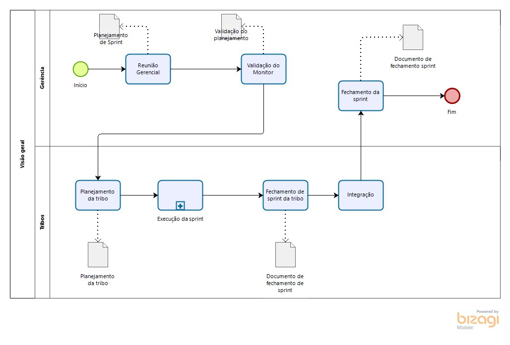
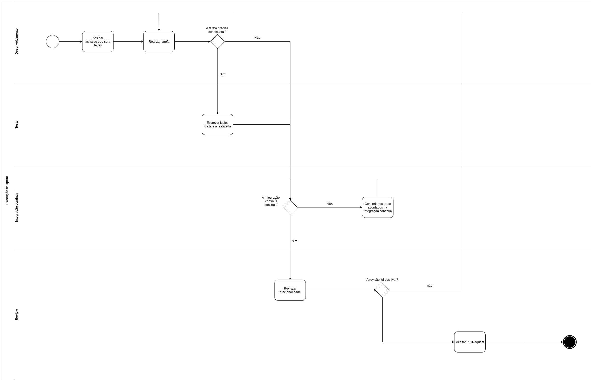

# BPMN's

Nesta página pode se encontrar os modelos de processo desenvolvidos pelo grupo alguns podem ser encontrados em outras paginas colocados em seus respectivos contextos.

**Modelo de processo de Divisão de tribos**

|**Objeto**|**BPMN**|
|--|--|
|**Versões anteriores**| - |
|**Versão**| 1.0 |
| **Descrição** | Bpmn divisão de tribos |
| **Data** | 05/08/2019 |

**Modelo de processo - Discução temas**

|**Objeto**|**BPMN**|
|--|--|
|**Versões anteriores**| - |
|**Versão**| 1.0 |
| **Descrição** | Bpmn discução temas |
| **Data** | 03/08/2019 |

**Modelo de processo - Escolha de temas**

|**Objeto**|**BPMN**|
|--|--|
|**Versões anteriores**| - |
|**Versão**| 1.0 |
| **Descrição** | Bpmn escolha temas |
| **Data** | 04/08/2019 |

**Modelo de processo - Documentação **

|**Objeto**|**BPMN**|
|--|--|
|**Versões anteriores**| - |
|**Versão**| 1.0 |
| **Descrição** | Bpmn documentação |
| **Data** | 04/08/2019 |

**Modelo de processo - Metodologia**

|**Objeto**|**BPMN**|
|--|--|
|**Versões anteriores**| - |
|**Versão**| 1.0 |
| **Descrição** | Bpmn metodologia |
| **Data** | 04/08/2019 |

**Modelo de processo - Metodologia**

|**Objeto**|**BPMN**|
|--|--|
|**Versões anteriores**| - |
|**Versão**| 1.0 |
| **Descrição** | Bpmn da Sprint |
| **Data** | 04/08/2019 |
