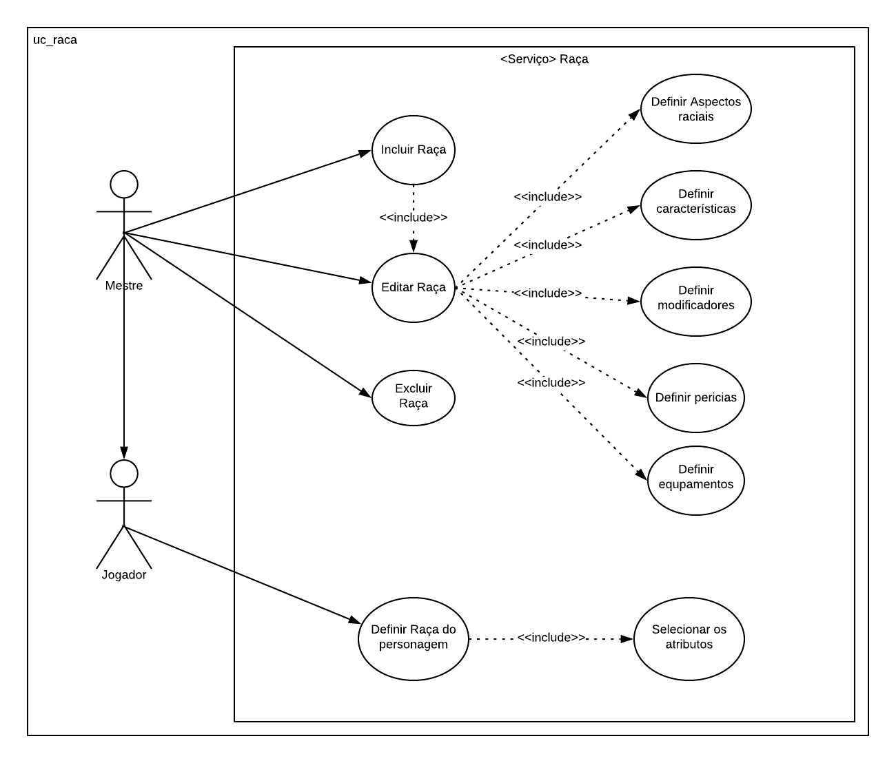
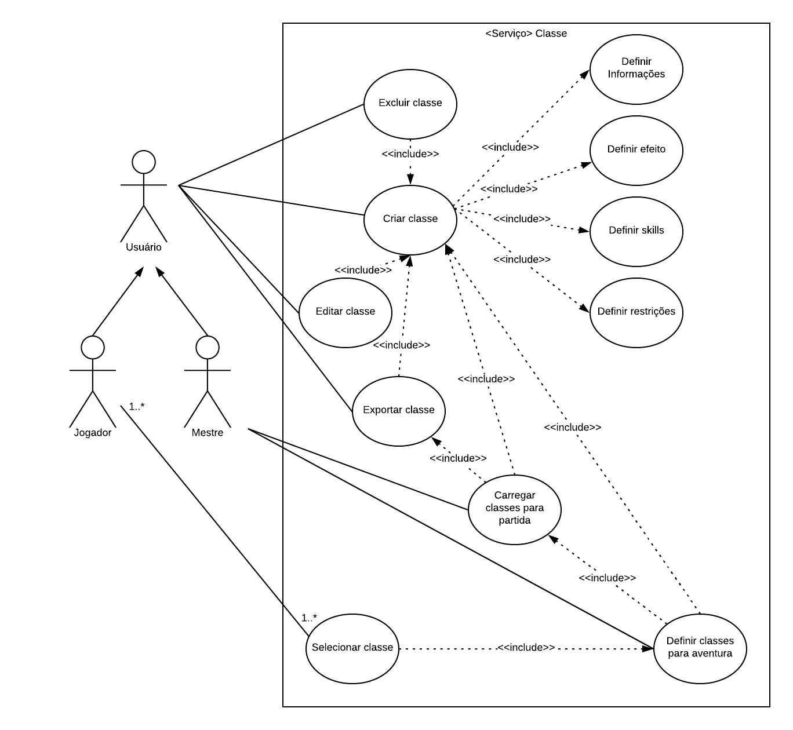
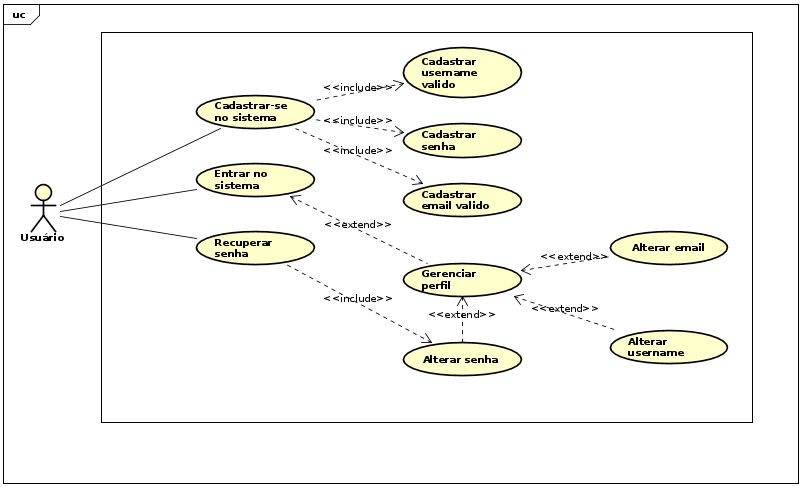

# Diagramas de caso de uso

### Feature de controle de fichas ou personagem

| **Objeto** | **Diagrama UC para personagem/ficha** |
|--|--|
| **Versões anteriores** | [2.0](../img/casos-de-uso/uc_fichas_v2.png) [1.0](../img/casos-de-uso/uc_fichas_v1.png) |
|**Versão**| 3.0 |
| **Autor** | André de Sousa |
| **Data** | 12/09/2019 |

### Feature de controle de itens

| **Objeto** | **Diagrama UC para itens** |
|--|--|
| **Versões anteriores** | N/A |
|**Versão**| 1.0 |
| **Autor** | André de Sousa |
| **Data** | 14/09/2019 |

### Feature de controle de skills ou habilidades

| **Objeto** | **Diagrama UC para skills/habilidades** |
|--|--|
| **Versões anteriores** | N/A |
|**Versão**| 1.0 |
| **Autor** | Gustavo Duarte Moreira |
| **Data** | 19/09/2019 |

### Feature de controle de raças

| **Objeto** | **Diagrama UC para raças** |
|--|--|
| **Versões anteriores** | N/A |
|**Versão**| 1.0 |
| **Autor** | Gustavo Duarte Moreira |
| **Data** | 19/09/2019 |

### Feature de controle de classes

| **Objeto** | **Diagrama UC para classes** |
|--|--|
| **Versões anteriores** | [1.0](uc_classes_v2.png) |
|**Versão**| 2.0 |
| **Autor** | Yoshida |
| **Data** | 12/09/2019 |

### Feature de controle de usuarios

| **Objeto** | **Diagrama UC para usuarios** |
|--|--|
| **Versões anteriores** | N/A |
|**Versão**| 1.0 |
| **Autor** | Assis |
| **Data** | 13/09/2019 |

### Feature de controle de partidas

| **Objeto** | **Diagrama UC para partidas** |
|--|--|
| **Versões anteriores** | N/A |
|**Versão**| 1.0 |
| **Autor** |  |
| **Data** |  |

### Feature de controle de eventos

| **Objeto** | **Diagrama UC para eventos** |
|--|--|
| **Versões anteriores** | N/A |
|**Versão**| 1.0 |
| **Autor** |  |
| **Data** |  |
