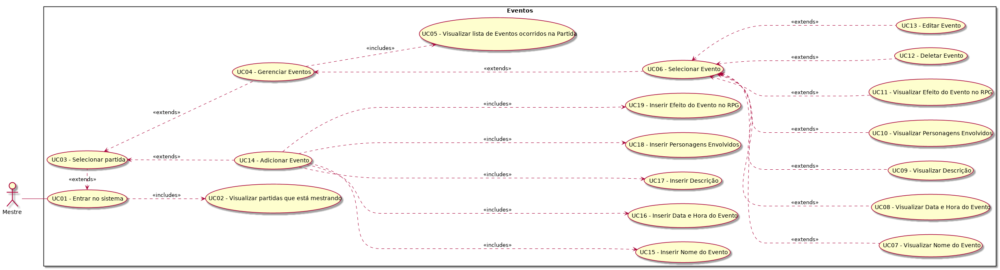

# Diagramas de caso de uso

## 1. Introdução
Os diagramas comportamentais na notação UML documenta o sistema do ponto de vista do usuário. Em outras palavras, ele descreve as principais funcionalidades do sistema e a interação dessas funcionalidades com os usuários do mesmo sistema. Também corresponde a uma visão externa do sistema e representa graficamente os atores, os casos de uso, e os relacionamentos entre estes elementos. Ele tem como objetivo ilustrar em um nível alto de abstração quais elementos externos interagem com que funcionalidades do sistema, ou seja, a finalidade de um diagrama de caso de uso é apresentar um tipo de diagrama de contexto que apresenta os elementos externos de um sistema e as maneiras segundo as quais eles as utilizam.

## 2. Objetivos
A execução dos diagramas de caso de uso tem como objetivo aplicar a modelagem de requisitos e descrever o uso de uma funcionalidade do sistema, apresentando as características ou comportamentos da aplicação Master of Puppets.

## 3. Metodologia
O desenvolvimento da atividade se constituiu na seguinte metodologia: via Slack, os integrantes da tribo homem-macaco separaram seus respectivos temas para elaboração dos diagramas. Com os temas selecionados, os alunos desenvolveram os diagramas em ferramentas como Draw.io.

## Feature de controle de fichas ou personagem

| **Objeto** | **Diagrama UC para personagem/ficha** |
|--|--|
| **Versões anteriores** | [2.0](../img/casos-de-uso/uc_fichas_v2.png) [1.0](../img/casos-de-uso/uc_fichas_v1.png) |
|**Versão**| 3.0 |
| **Autor** | André de Sousa |
| **Data** | 12/09/2019 |

## Feature de controle de itens

| **Objeto** | **Diagrama UC para itens** |
|--|--|
| **Versões anteriores** | N/A |
|**Versão**| 1.0 |
| **Autor** | André de Sousa |
| **Data** | 14/09/2019 |

## Feature de controle de skills ou habilidades

| **Objeto** | **Diagrama UC para skills/habilidades** |
|--|--|
| **Versões anteriores** | N/A |
|**Versão**| 1.0 |
| **Autor** | Gustavo Duarte Moreira |
| **Data** | 19/09/2019 |

## Feature de controle de raças

| **Objeto** | **Diagrama UC para raças** |
|--|--|
| **Versões anteriores** | N/A |
|**Versão**| 1.0 |
| **Autor** | Gustavo Duarte Moreira |
| **Data** | 19/09/2019 |

## Feature de controle de classes

| **Objeto** | **Diagrama UC para classes** |
|--|--|
| **Versões anteriores** | [1.0](uc_classes_v2.png) |
|**Versão**| 2.0 |
| **Autor** | Yoshida |
| **Data** | 12/09/2019 |

## Feature de controle de usuarios

| **Objeto** | **Diagrama UC para usuarios** |
|--|--|
| **Versões anteriores** | N/A |
|**Versão**| 1.0 |
| **Autor** | Assis |
| **Data** | 13/09/2019 |

## Feature de controle de partidas

| **Objeto** | **Diagrama UC para partidas** |
|--|--|
| **Versões anteriores** | N/A |
|**Versão**| 1.0 |
| **Autores** | <li>Guilherme de Lyra</li><li>Gustavo Duarte</li><li>André Filho</li> |
| **Data** | 19/09/2019 |

## Feature de controle de eventos

| **Objeto** | **Diagrama UC para eventos** |
|--|--|
| **Versões anteriores** | N/A |
|**Versão**| 1.0 |
| **Autor** | Guilherme de Lyra |
| **Data** | 15/09/2019 |

## 5. Referências
* Vazquez, Carlos; Simões, Guilherme (2016). Engenharia de Requisitos: Software Orientado ao Negócio.
