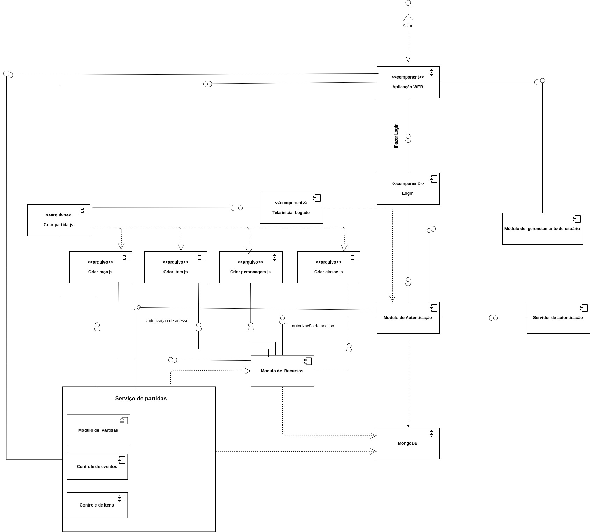

# Diagrama de componentes

## 1. Introdução

Diagrama de sequência (ou Diagrama de Sequência de Mensagens) é um diagrama usado em UML (Unified Modeling Language), representando a sequência de processos (mais especificamente, de mensagens passadas entre objetos) num programa de computador. Como um projeto pode ter uma grande quantidade de métodos em classes diferentes, pode ser difícil determinar a sequência global do comportamento. O diagrama de sequência representa essa informação de uma forma simples e lógica. Segundo Serrano, "Trata-se do diagrama dinâmico mais relevante na UML, em especial, para fase de projeto do software. Confere, dentre outras particularidades, a representação das interações entre os objetos, distribuídas entre várias linhas de vida.".

## 2. Objetivo

A confecção do diagrama de sequência tem como finalidade descrever a interações entre os objetos do sistema para, depois, definir como o softare realizará seu papel (Sequência de Operações) 

## 3. Diagrama componentes do sistema

[Visualizar em tamanho maior](../img/component-diagram/cd_full_v1.jpg)

| **Objeto** | **Diagrama componentes do sistema** |
| -- | -- |
| **Versões anteriores** | N/A |
|**Versão**| 1.0 |
| **Autores** | Arthur Rodrigues André Eduardo |
| **Data** | 19/09/2019 |

## 4. Referências

* SERRANO, Milene. Arquitetura e Desenho de Software - Aula Modelagem UML Dinâmica. 2º/2019. 28 slides. Material apresentado para a disciplina de Arquitetura e Desenho de Software no curso de Engenharia de Software da UnB, FGA.

* BOOCH, G; RUMBAUGH, J e JACOBSON, I: UML, Guia do Usuário: tradução; Fábio Freitas da Silva, Rio de Janeiro, Campus, 2012.
