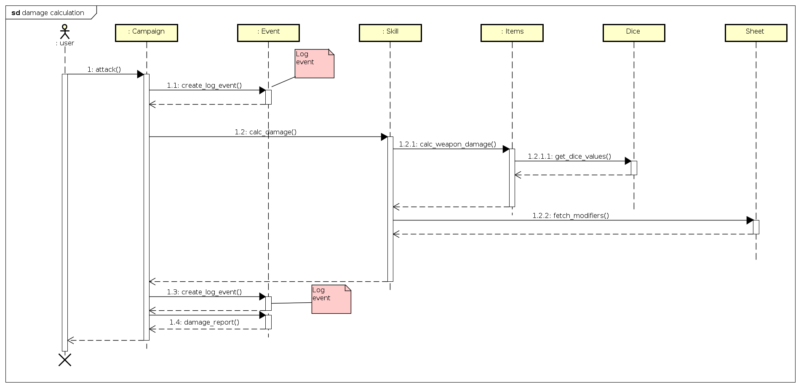
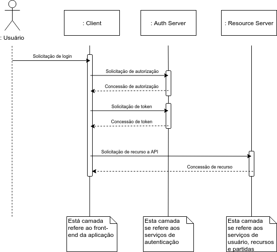

# Diagrama de sequência

## Sequência de calculo de dano

[Visualizar em tamanho maior](../img/diag-sequencia/sd_damage_calculus_v5.png)

| **Objeto** | **Diagrama de sequência de calculo de dano** |
|--|--|
| **Versões anteriores** | [4.0](../img/diag-sequencia/sd_damage_calculus_v4.png) [3.0](../img/diag-sequencia/sd_damage_calculus_v3.png) [2.0](../img/diag-sequencia/sd_damage_calculus_v2.png) [1.0](../img/diag-sequencia/sd_damage_calculus_v1.png) |
|**Versão**| 5.0 |
| **Autor** | André de Sousa |
| **Data** | 18/09/2019 |

## Sequência de login

[Visualizar em tamanho maior](../img/diag-sequencia/sd_login_v2.png)

| **Objeto** | **Diagrama de sequência de login** |
|--|--|
| **Versões anteriores** | [1.0](../img/diag-sequencia/sd_login_v1.png) |
|**Versão**| 2.0 |
| **Autor** | André Bargas |
| **Data** | 17/09/2019 |
