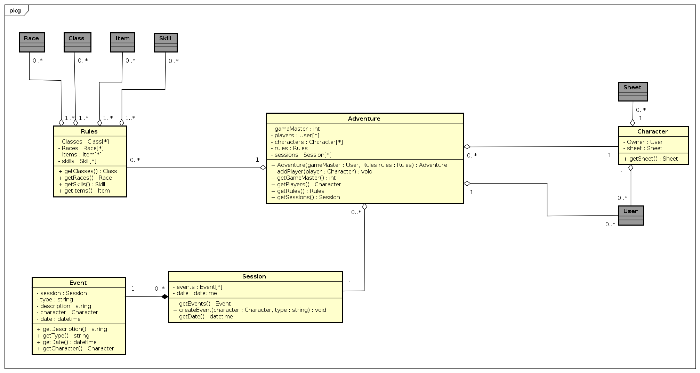
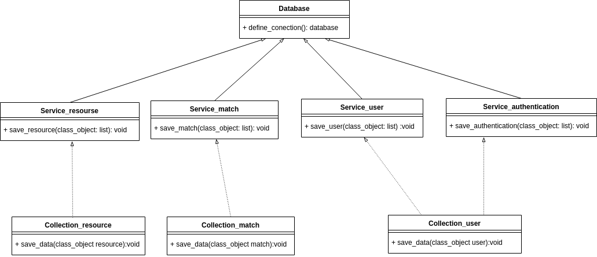

# Diagramas de classe

## Diagrama de classe para Usuário

## Diagrama de classe para Partida

Usuário
## Diagrama de classe para Recursos

### Diagrama de classe para Autenticação

[ Versão 2 ](../img/diagramas_de_classe/UML_autenticacao_2.png)

[ Versão 1 ](../img/diagramas_de_classe/UML_autenticacao.png)

### Diagrama de classe para conexão com o banco

|**Data**|**Versão**|**Descrição**|
|--|--|--|
|15/09/2019|0.1|CriaçãDocumentos|
|16/09/2019|0.2|Adicionando diagrama de recursos|
|16/09/2019|0.3|Adicionando diagrama de autenticação|
|17/09/2019|0.4|Adicionando nova versão diagrama de autenticação|
|17/09/2019|0.5|Atualiza diagrama de recursos|
|19/09/2019|0.6|Atualiza diagrama de recursos|
|19/09/2019|1.0|Adicionando diagrama de banco de dados|

## Referências

* https://www.lucidchart.com/pages/pt/o-que-e-diagrama-de-classe-uml
