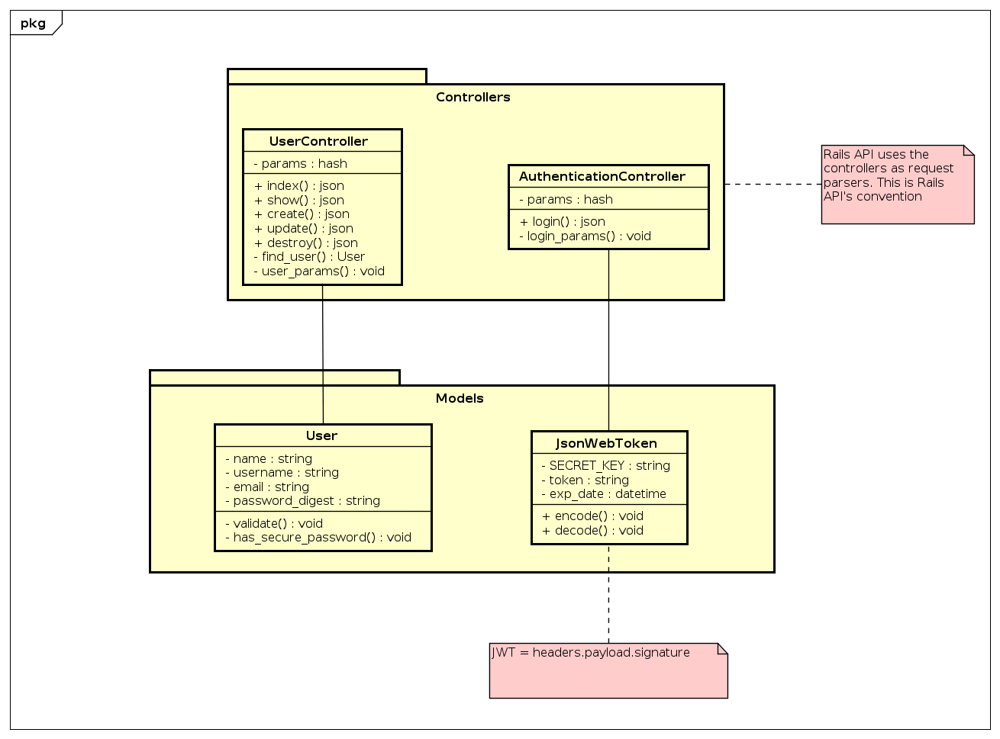
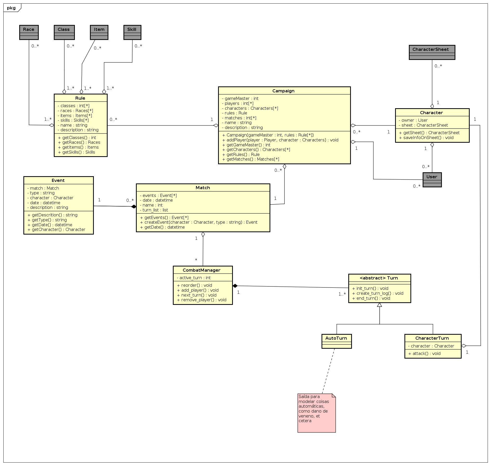
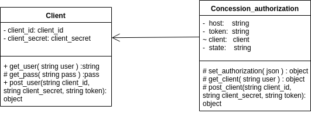
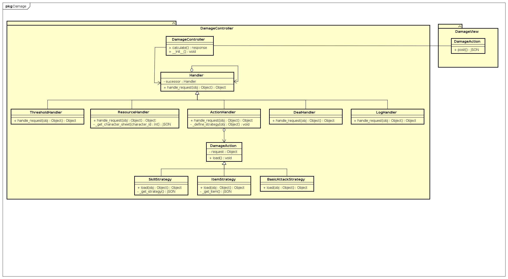

# Diagramas de classe

## Diagrama de classe para Usuário e Autenticação

[Visualizar em tamanho maior](../img/diagramas_de_classe/class_users_auth_v3.png)

- [Versão 2](../img/diagramas_de_classe/UML_usuario_V2.png)
- [Versão 1](../img/diagramas_de_classe/UML_usuario.png)

 ---

## Diagrama de classe para Partida

[Visualizar em tamanho maior](../img/diagramas_de_classe/classes_match_v3.png)

- [Versão 2](../img/diagramas_de_classe/classes_match_v2.png)
- [Versão 1](../img/diagramas_de_classe/UML_partida.png)

 ---

## Diagrama de classe para Recursos

[Visualizar em tamanho maior](../img/diagramas_de_classe/UML_recursos_V4.png)

- [Versão 3](../img/diagramas_de_classe/UML_recursos_V3.png)
- [Versão 2](../img/diagramas_de_classe/UML_recursos_V2.png)
- [Versão 1](../img/diagramas_de_classe/UML_recursos_V1.png)

 ---

<!-- ### Diagrama de classe para Autenticação

[Visualizar em tamanho maior](../img/diagramas_de_classe/UML_autenticacao_4.png)

- [ Versão 3 ](../img/diagramas_de_classe/UML_autenticacao_3.png)
- [ Versão 2 ](../img/diagramas_de_classe/UML_autenticacao_2.png)
- [ Versão 1 ](../img/diagramas_de_classe/UML_autenticacao.png)

--- -->

### Diagrama de conexão com o banco

[Visualizar em tamanho maior](../img/diagramas_de_classe/UML_database.png)

### Diagrama de Classe do Sistema de Cálculo de Dano

[Visualizar em tamanho maior](../img/diagramas_de_classe/UML_dano_2.png)

## Tabela de Versionamento 

|**Data**|**Versão**|**Descrição**|**Autores**|
|--|--|--|--|
| 15/09/2019 | 0.1 | Criação Documentos | Lucas Machado |
| 16/09/2019 | 0.2 | Adicionando diagrama de recursos | Eduardo Yoshida |
| 16/09/2019 | 0.3 | Adicionando diagrama de autenticação | Lucas Machado |
| 17/09/2019 | 0.4 | Adicionando nova versão diagrama de autenticação | Lucas Machado |
| 17/09/2019 | 0.5 | Atualiza diagrama de recursos | Eduardo Yoshida |
| 19/09/2019 | 0.6 | Atualiza diagrama de recursos | Arthur assis |
| 19/09/2019 | 1.0 | Adicionando diagrama de banco de dados | Lucas Machado |
| 23/09/2019 | 1.1 | Atualizando diagramas | Lucas Machado |
| 04/10/2019 | 1.2 | Links para imagens maiores | André de Sousa |
| 24/10/2019 | 1.3 | Atualizando diagrama de classes do sistema de partidas com nomenclatura certas | André de Sousa |
| 11/11/2019 | 1.4 | Atualizando diagrama de classes do sistema de partidas com modelagem de combate | André de Sousa |
| 11/11/2019 | 1.5 | Adiciona versões passadas dos diagramas de classe | André de Sousa |
| 17/11/2019 | 1.6 |Adiciona diagrama de classe do sistema de cálculo de dano|Eduardo Yoshida|
| 18/11/2019 | 1.7 | Adiciona versão | André de Sousa; André Bargas |
| 18/11/2019 | 1.8 | Atualiza diagrama de classe do sistema de cálculo de dano | Eduardo Yoshida |

## Referências

* https://www.lucidchart.com/pages/pt/o-que-e-diagrama-de-classe-uml
