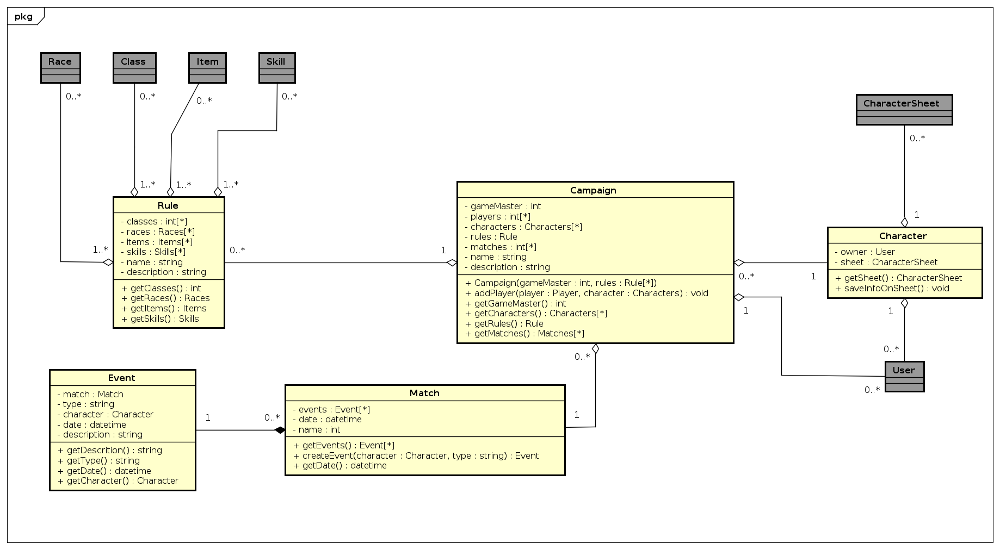

# Análise de viabilidade dos GoFs criacionais

## Factory method

### Estudo viabilidade
- Interessante para casos onde há poucas diferenças entre os herdeiros.
- Pode ser usado em conjunto com um object pool.
- Criação por **herança**.

### Implementação
- Implementação na geração de itens, especialistas ou não.
- Implementação na geração de skills.

---

## Abstract factory

### Estudo viabilidade
- Maior flexibilidade que o Factory
- Melhor para criar família de objetos produtos.
- Comparável com o Prototype

### Implementação
- Caso se mostre necessário no futuro, por conta de precisar de maior flexibilidade, substituir o Factory

---

## Singleton

### Estudo viabilidade
- Desempenho por inicializar apenas quando for ser usado.
- Faz com que a classe tenha apenas uma instância, global.
- Complicação para deleção de instâncias.
- Pode ser usado com _abstract factory_, _builder_ e _prototype_.
- Se usa apenas uma única instância de _facade_, logo pode se usar um singleton.

### Implementação
- Caso seja implementada uma _facade_ abrangindo o sistema de recursos, ela será implementada como um singleton.

---

## Builder

### Estudo viabilidade
- Interessante para construção de objetos complexos. (Talvez para CharacterSheet)
- Melhor para criar objetos com bastante agregação.
- Para variações nos detalhes, mas com o mesmo processo de construção.

### Implementação
- Extremamente viável para a construção de fichas de personagem, onde se muda as informações agregadas, mas o processo se mantém.

---

## Prototype

### Estudo viabilidade
- Cria uma instância que serve de "forma" para novos objetos
- Criação por delegação. Difere dos factories aqui.
- Se depende muito de _composite_ e _decorator_, pode ser interessante usar o prototype

### Implementação
- Até o momento, não foram encontrados pontos de implementação.

---

## Object pool

### Estudo viabilidade
- A maior vantagem do object pool é o aumento de desempenho através do 'caching' de objetos.
- Interessante de se anialisar caso tenhamos problema de desempenho com a relação partida-jogador-personagem
- Interessante para casos de factory que precisem de tracking de objetos apos ser criados

### Implementação
- Pode valer a pena caso venha a dar problema de desempenho futuro aqui:

---

## Referências:
- Source Making. 2019. Design patterns. [ONLINE] Available at: https://sourcemaking.com/design_patterns/. [Accessed 24 October 2019].
