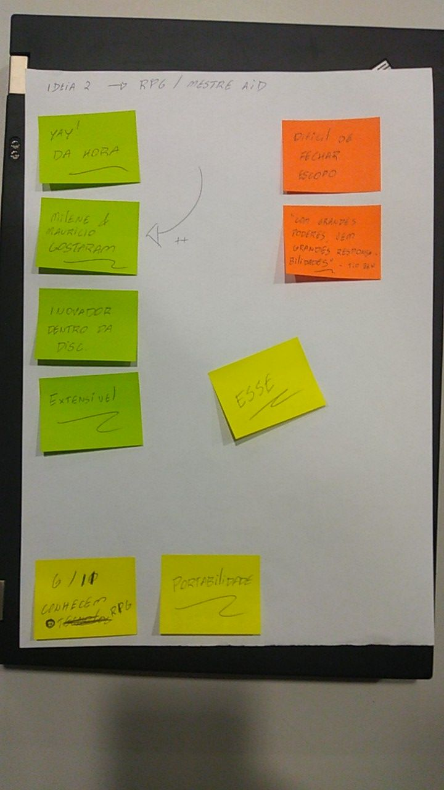
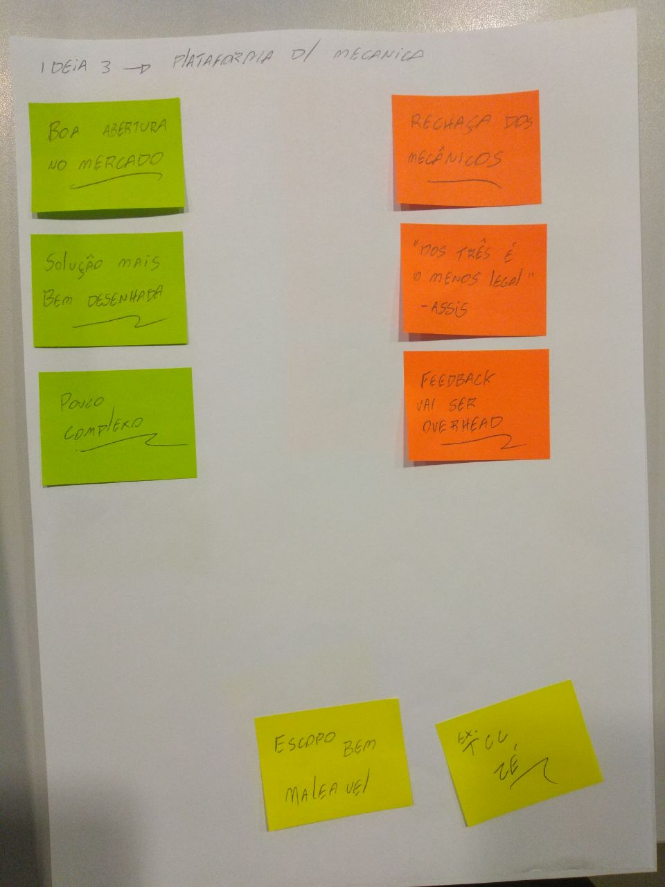

# Discução de temas

Inicialmente foi comentado com o grupo e pedido para que todos os membros do grupo trouxessem ideias para que depois todo grupo escolher um dos temas.

Os temas sugeridos foram:
    
* Ideia 1 : Cenários e Lexícos
* Ideia 2 : Auxílio do mestre de RPG
* Ideia 3 : Plataforma para mecanica
* Ideia 4 : Game

Todos os temas foram apresentados do e os membros tiraram suas duvidas, lodo depois passamos por todos os temas e colocando os pontos positivos e negativos e as observações julgadas necessárias, isto pode ser visto nas imagens abaixo.

## Ideia 1 

Sugerida por Artuhr Rodrigues

## Ideia 2

Sugerida por Lucas Machado

## Ideia 3 

Sugerida por André Eduardo
## Ideia 4

Sugerida por Guilherme de Lyra

## Conclusão

Após analisar todos os possíveis projetos por maioria de votos e indicações externas o tema 2 foi escolhido pela maioria.