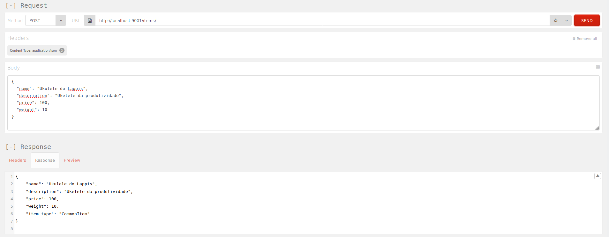
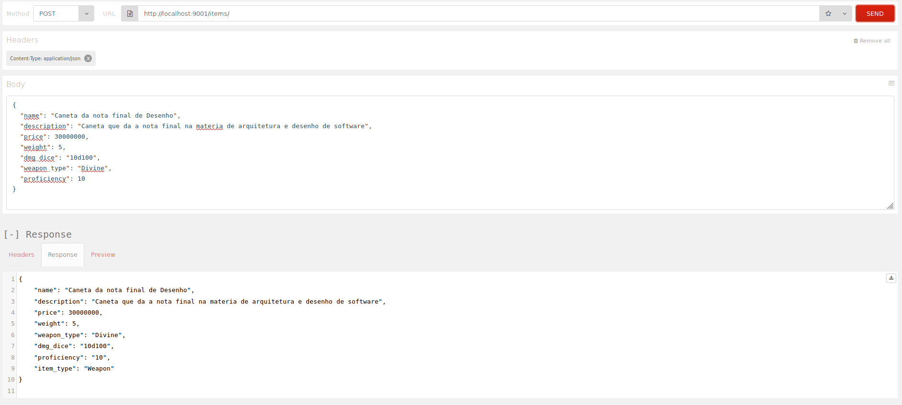
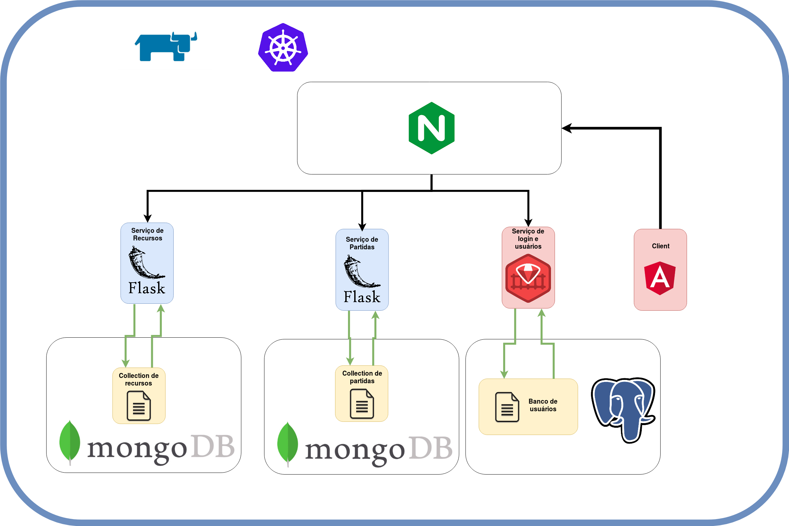

# Documento de Arquitetura - Master of Puppets


## 1. Introdução

### 1.1 Finalidade
Este documento apresenta uma visão geral abrangente da arquitetura do projeto Master of Puppets, buscando ilustrar os mais diversos aspectos do sistema. O documento permitirá um maior entendimento do sistema em si, do comportamento do mesmo e como ele irá se comunicar com as outras aplicações do projeto. Este projeto fora desenvolvido na disciplina Arquitetura e Desenho de Software, e possui como principal foco a comunidade academica da Universidade de Brasília campus Gama.

### 1.2 Escopo
Neste documento serão descritos os componentes de software, padrões arquiteturais adotados e frameworks escolhidos para o desenvolvimento do projeto. O objetivo do projeto é a criação de portal capaz de axuliar jogadores de RPGs a gerenciarem fichas e recursos do jogo durante suas partidas, sendo possivel também a reutilização de recursos e compartilhamento de componentes criado por terceiros usuários.

### 1.3 Definições, Acrônimos e Abreviações
* API: Sigla para "Application Programming Interface", pode ser entendido como um conjunto de rotinas e padrões de programação para acesso a um aplicativo de software ou plataforma baseado na Web.
* MVC: Model-view-controller
* Back-end: Camada de serviços da aplicação
* Front-end: Camada de apresentação da aplicação
* RPG: Role-playing Game

### 1.4 Visão Geral
O presente documento faz o detalhamento e descrição de características da arquitetura escolhidas pela equipe de desenvolvimento para a solução no software do projeto Master of Puppets. Nele estará presente: Representação da Arquitetura, Metas e Restrições de Arquitetura, Visão de Implantação, Visão de Implementação, Visão de Dados.


## 2. Estilos Arquiteturais

### 2.1 Micro serviços
### 2.1 Serviços
Nosso sistema é modelado usando a arquitetura orientada a serviços. Escolhemos essa arquitetura por conta da facilidade de dividir os serviços entre os membros do grupo e a reusabilidade que essa arquitetura provê. Os microsserviços previstos na arquitetura são:

* Serviço de recursos
* Serviço de partidas
* Serviço de gerência de usuários
* Serviço de autenticação

<!-- Cada serviço possui a capacidade de manter funcionalidades do seu escopo com a queda ou indisponibilidade de outros serviços, a menos que exista uma dependência muito grande. -->

## 3. Padrões de projeto

### 3.1 Model View Controller

Cada um dos serviços será construído com a arquitetura interna no padrão MVC. No padrão MVC clássico, a aplicação é dividida em três principais componentes interconectados, sendo esses:

* Model: é responsável por tratar a parte lógica relacionada aos dados, sua estrutura, consultas e validação. Deve-se também atentar as regras de negócio relacionadas a persistência dos dados no banco de dados.

* View: é responsável pela interação com o usuário, definindo também quais são as regras de experiências de usuário desejadas. É importante ressaltar que a view possui comunicação somente com a camada Controller.

* Controller: efetua a comunicação entre a Model e a View. Nessa camada são explicitadas as regras comerciais referentes a manipulação do sistema. Em resumo, é responsável por acessar os dados providos pela Model, manipulá-los e serví-los a camada View.

### 3.2 Proxy

Nossa arquitetura prevê a existência de uma camada de proxy para a disponibilização das informações dos serviços.
Essa camada é implementada no servidor por meio da ferramenta NGINX, implementado através de um *plug-in* da ferramente de  orquestramento de serviços Rancher. Falaremos com mais detalhes sobre os padrões usados nas ferramentas mais a frente.

### 3.3 Singleton no banco de dados

A comunicação com o banco de dados é feita a partir de um singleton criado pela biblioteca mongoengine.

```python
mongoengine.connect(
  db='mop',
  host='mongodb://mongo_main:27017/mop',
  alias='campaigns_connection'
)
```

Se o usuário tentar realizar essa chamada em outro lugar, a biblioteca soltará uma exceção.

### 3.4 Factory Method

A criação de objetos do tipo `Item` ou `Skill` dentro do sistema é feita a partir da aplicação do padrão Factory Method. Esse método é chamado quando o usuário faz uma requisição para criar um objeto e retorna o tipo esperado baseado nos campos que o usuário passar. Abaixo um exemplo de como o *ItemFactory* funciona:

Se os campos padrões forem passados, ele retornará um `CommonItem`, como demonstrado:



Mas se os campos necessários para se criar um `Weapon` forem passados, ele retornará um `Weapon`.



<!-- colocar trecho de código/diagrama -->

### 3.5 Memento


### 3.6 Padrões de projetos identificados nas ferramentas usadas
#### 3.6.1 Flask micro-framework

Foram identificados os seguintes padrões na ferramenta Flask:

- Singleton: A instância da aplicação `Flask.app()` é um singleton.

#### 3.6.2 Rancher

- Kubernetes:

#### 3.6.3 Mongo


#### 3.6.4 NGINX

- Proxy:
- Proxy reverso:

#### 3.6.5 Rails API

- Active Record:
- Rails API MVC: adaptação feita no Rails do padrão MVC, possuindo apenas as camadas
de __Model__ e __Controller__.


## 4. Metas e restrições

### 4.1 Metas

* Facilitar a criação e manutenção de fichas durante uma partida de RPG.
* Oferecer uma plataforma de auxílio ao mestre e jogadores de RPG.
* Oferecer um registro das principais decisões tomadas durante uma partida.

### 4.2 Restrições

* A aplicação deverá ter acesso a internet.
* A aplicação terá informações restritas  que só poderão ser vistas e editadas por meio de autenticação.


## 5. Representação da Arquitetura

A arquitetura utilizada é composta por micro serviços, podendo ser implementado com quaisquer framework para construção de aplicações web. A arquitetura fora pensada para que o serviços sejam implementados com o framework Flask. Estes serviços consumirão de recursos do serviço de banco de dados MongoDB. O principal papel do Flask é a implementação das APIs onde serão dispostos cada um dos produtos na forma de um micro-serviço. Cada micro serviço disponibilizará uma API RestFull. O serviço de banco de dados (MongoDB) será responsável pela persistência dos dados de usuários.

A camada do gateway será implementada com o servidor de proxy reverso NGINX. A ferramenta forá escolhida devido ser rápido, leve e de uso aberto.

O frontend será escrito em Angular e ficará responsável apenas por receber os dados que virão dos microsserviços que compõem a aplicação. Nesta camada também é as possiveis interações do usuário com a aplicação.

Na camada de persistencia foi escolhido o banco de dados NoSQL MongoDB. Esta ferramenta foi escolhida devido a familiaridade da equipe com a técnologia e sua boa integração com outras ferramentas do projeto. As coleções para cada servilo serão idenpendetes e conversarão apenas com seu respectivo serviço, com execeção da coleção de dados de usuário que conversara com o serviço de autenticação e de gerenciamento de usuário.

### 5.1 Visão Geral do Arquitetura



[Visualizar em tamanho maior](../img/diagrama_arquitetura/arquitetura_mop.png)

Versões passadas:
- [Versão 01](../img/doc_arquitetura/visao_geral_arquitetura.png)

### 5.2 Serviços

#### 5.2.1 Serviço de Recursos

Esta  fronteira é responsável pelo gerenciamento dos recursos básicos da aplicação, estabelecendo  uma intermediação entre o banco de dados e os outros serviços.


#### 5.2.2 Serviço de Partidas

Esse serviço  é responsável por gerenciar os dados gerados durante as partidas.

#### 5.2.3 Serviço de Gerenciamento de Usuários

Fica a cargo desse serviço o gerenciamento dos dados dos usuários dentro da aplicação.

#### 5.2.3 Serviço de Gerenciamento de Usuários

Este serviço é responsável por autenticar usuários e aplicações que desejam acessar recursos protegidos. Está autenticação será feita pelo padrão OAuth2.


<!-- ## 6. Visão de Dados

## 7. Visão de Implantação

## 8. Visão de Implementação -->
