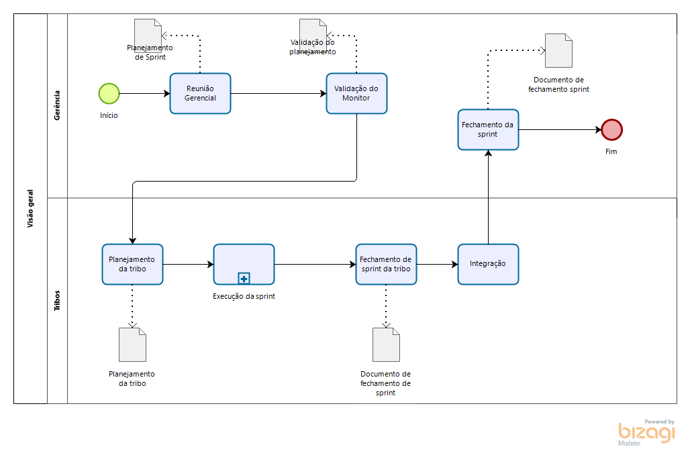

# Metodologia de desenvolvimento

## Histórico de revisões
|   Data   |  Versão  |        Descrição       |          Autor(es)          |
|:--------:|:--------:|:----------------------:|:---------------------------:|
|05/09/2019|   0.1    | Iniciando o documento       |   Gustavo Duarte Moreira  |
|05/09/2019| 0.2 | Revisão e justificativa | André de Sousa |
|05/09/2019| 0.3 | Organização geral | André de Sousa |

## Sumário
[1. Introdução](#1-introducao)  
[2. Organição Geral](#2-organizacao-geral)  
[3. Relatórios e Gravações](#3-relatorios-e-gravacoes)  
[4. Gerência](#4-gerencia)  
[5. Repositórios](#5-repositorios) 
[6. Issues](#6-issues) 
[7. Referências ](#7-referencias)

## 1. Introdução

A metodologia que será usada ao longo do projeto foi elaborada pelo grupo e decidida nas reuniões, com o participação de todos foram decididos a organização da equipe, os papeis dos membros, forma de trabalho entre outra definições abordadas abaixo.

## 2. Justificativa

No início do projeto a equipe demonstrou bastante aversão e, consequentemente, classificou como risco de grande impacto o tamanho da equipe, já que isto tem impacto direto com a eficiência da comunicação interna.

Tendo estes problemas em mente, a equipe pensou em adotar uma metodologia baseada no sistema de tribos do **SAFE**. Originalmente este sistema é utilizado para empresas de grande porte gerenciarem equipes grandes - e muitas vezes trabalhando remotamente, porém a equipe viu como uma oportunidade de mitigar riscos de gerência e comunicação.

## 3. Organização geral

O grupo decidiu se organizar em duas equipes de trabalho(tribos), cada uma conta com um gerente(lider técnico) e mais quatro integrantes. Também foi definido um Gerente geral para garantir a organização do trabalho e o andamento das demandas ao longo do andamento do projeto. 

No diagrama abaixo, está ilustrado como se dá o processo de trabalho durante uma sprint comum dentro da nossa metodologia. Ele ocorre da seguinte maneira:

1. **Reunião gerencial:** a sprint começa nas **terças-feiras** com uma reunião entre os gerentes, na qual priorizam e decidem quais atividades serão realizadas assim como por quem elas serão realizadas. Desta reunião é gerado o documento de planejamento geral da sprint.
2. **Validação do monitor:** o planejamento poderá ou não ser validado pelo monitor da disciplina, com essa validação (que não é necessária em todas as sprints), se obtém o documento validado de planejamento.
3. **Planejamento da tribo:** este é um planejamento de sprint que ocorrerá internamente à cada uma das tribos, de forma a elas se articularem para o desenvolvimento das atividades. Com isso, cada tribo terá seu próprio planejamento, que será anexado ao planejamento geral de sprint. O planejamento individual de cada tribo visa diminuir a distribuição irregular de carga entre os membros da equipe.
4. **Execução da sprint:** cada tribo executará sua sprint, sendo que *não é obrigatório que ambas sigam os mesmos rituais*, mas sim que criem os seus próprios e que os sigam, conforme eles se mostrem necessários.
5. **Fechamento de sprint das tribos:** neste ponto, ambas as tribos terminam suas atividades e fazem um relatório de final de sprint, a fim de ser usado para compor o fechamento geral de sprint.
6. **Integração:** neste ponto são validadas as submissões das tribos e feita a integração das mesmas. Neste ponto é elaborada a ‘entrega’, já que serviços que funcionam somente separados de nada servem para a solução final. Caso uma submissão não seja integrável, esta ficará como dívida para a próxima sprint.
7. **Fechamento da sprint:** a última parte da sprint é a reunião de fechamento geral da sprint. Nesse documento serão documentados todas as ações e decisões feitas pela equipe ao decorrer da sprint.

Outros rituais importantes que possuímos são:

- Stand-up de integração da equipe as segundas-feiras
- Roda de conversa sobre viabilidade de aplicação de padrões  de projeto

## 4. Organização das Tribos e Gerência

A idéia da organização em tribos é conseguir se ter uma melhor comunicação e flexibilidade de rituais

## 5. Repositórios

A arquitetura decidida para o projeto de baseia no sistema arquitetural de serviços, abrangendo tanto micro-serviços, serviços externos e serviços internos. Foi decidido pela equipe que cada serviço teria seu próprio repositório, de forma a melhor poder dividir o trabalho.

## 6. Issues

Organização das Issues. 

## 7. Referências

