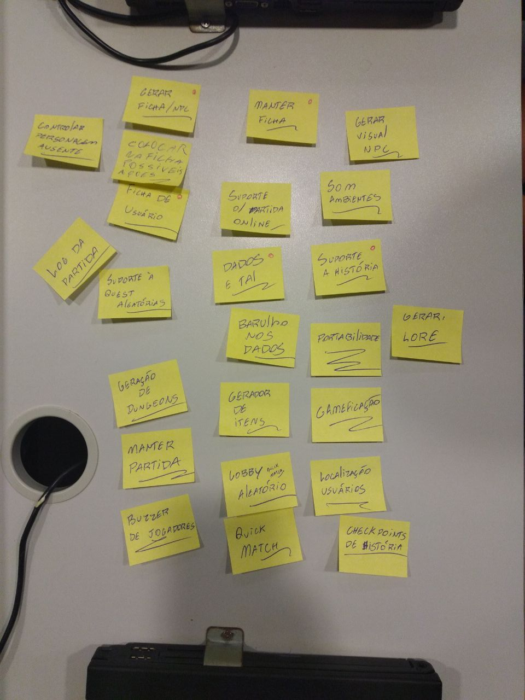
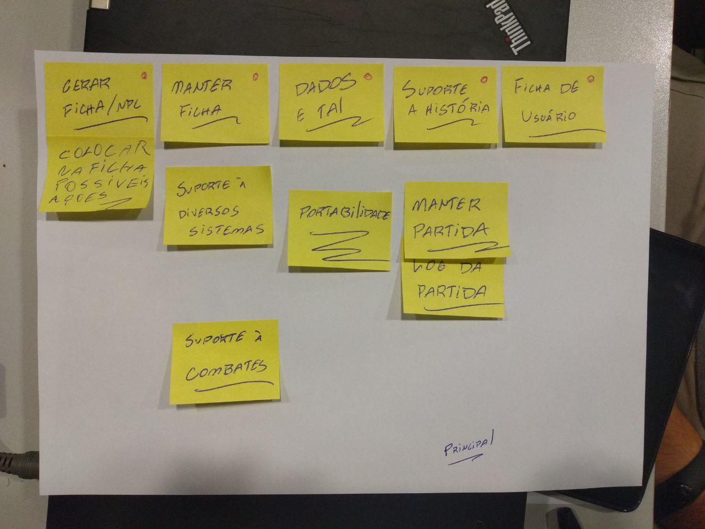
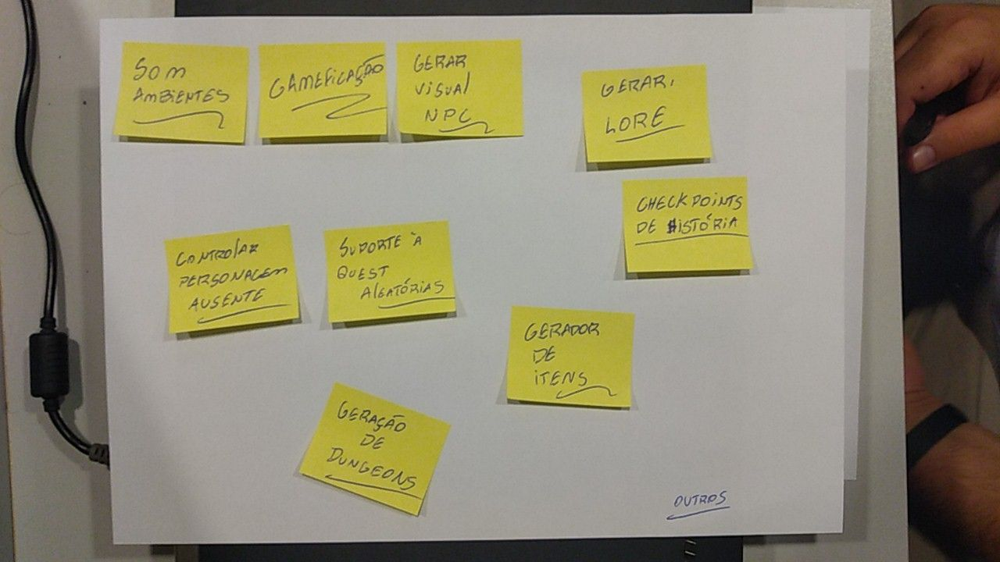

# **Brainstorm**

Após a decisão do tema foi realizado um Braimstorm que gerou diversas ideias, o resultado doi anotado em post-its e foram colocados em uma mesa como pode ser visto na imagem abaixo.

Com todas essas ideias decidimos organizalas, e organizamos entre as ideias que seram utilizadas para uma plataforma para que possa jogar online, uma que se sobrar tempo poderiamos realizar ou seja não e nossa prioridade e outra que seria o escopo do projeto.

## Escopo do projeto

## Escopo a para versão online

## Escopo do projeto

